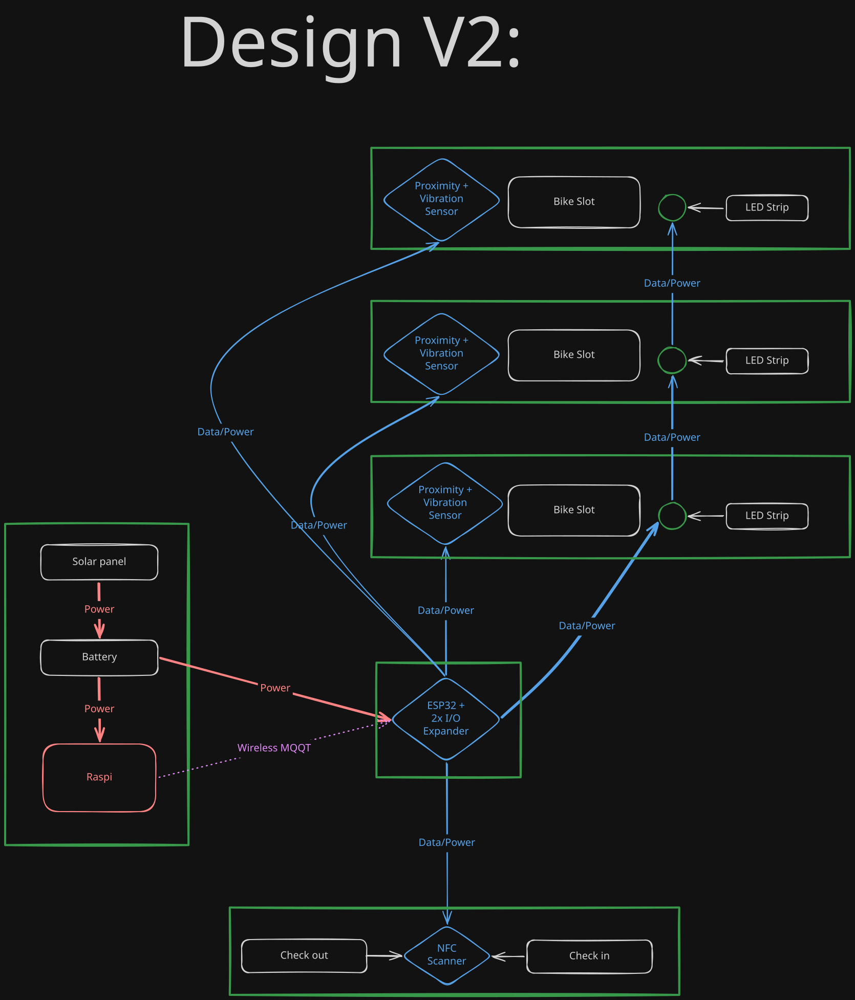

# Smart Bikestation — MQTT Backend

MQTT broker and dashboard for a smart bicycle parking station. A Raspberry Pi
runs Mosquitto and Node-RED; an ESP32-S3 reads the sensors and publishes to the
broker over WiFi.



## Stack

| Service    | Image                | Ports          | Purpose                                         |
|------------|----------------------|----------------|-------------------------------------------------|
| Node-RED   | `nodered/node-red`   | `1880`         | Flow engine + FlowFuse UI                       |
| Mosquitto  | `mosquitto:2`        | `1883`, `9001` | MQTT broker (TCP + WebSocket)                   |
| Postgres   | `postgres:16-alpine` | `5432`         | Every `bikestation/#` message, minute rollups   |
| Web        | `./web` (Node 22)    | `8080`         | Mobile dashboard, forecast, gate by phone       |
| Newt       | `fosrl/newt`         | –              | Pangolin tunnel, **separate compose in `~/newt`** |

- **Mobile dashboard:** `http://<pi>:8080` (see [web/README.md](web/README.md))
- **Node-RED editor:** `http://<pi>:1880/red/`
- **Node-RED dashboard:** `http://<pi>:1880/dashboard`
- **MQTT:** `mqtt://<pi>:1883` from the ESP32, `ws://<pi>:9001` from the browser
- **Postgres:** `psql -h <pi> -U nodered -d bikestation` (password in `docker-compose.yml`)

## Quick start

```bash
# one-time setup on a clean Raspberry Pi OS
./install.sh

# start the stack
docker compose up -d

# follow logs
docker compose logs -f

# stop
docker compose down
```

Both services bind to all interfaces, so they are reachable from the LAN as
soon as the stack is up.

## Layout

```
docker-compose.yml
install.sh                     one-time host setup (Docker + SSH key)
enable-ssh-key.sh              push this machine's public key to the Pi
gen_flows.py                   outdated generator, do not run (see below)
dockerfiles/
  mosquitto/Dockerfile
  nodered/Dockerfile
  nodered/start.sh             installs the dashboard module, then starts Node-RED
mosquitto/
  config/mosquitto.conf        listeners, persistence, anonymous access (demo)
postgres/
  init/01_schema.sql           telemetry table + occupancy views (first start only)
web/                           mobile dashboard container, see web/README.md
newt/
  docker-compose.example.yml   template for the Pangolin tunnel (real file on the Pi)
nodered/
  settings.js                  /red editor root, credential secret, context on disk
  flows.json                   the flow — edit in the Node-RED editor (/red) or here
docs/
  Hackathon.md                 architecture, topic schema, BOM
  Design_v2.svg                physical design
```

`nodered/flows.json` is maintained by hand (Node-RED editor on the Pi, then
commit the file). `gen_flows.py` still builds the very first flow with the old
topic scheme; running it would overwrite everything.

## MQTT topics

All under the `bikestation/` root.

| Topic | Direction | Payload |
|---|---|---|
| `bikestation/slot{1-4}/distance` | ESP → broker | cm, every 200 ms; `999` = no echo |
| `bikestation/slot{1-4}/sensor` | ESP → broker | `ok` / `no_echo` (retained) |
| `bikestation/slot{1-4}/state` | Node-RED → ESP 1 | `free` green, `occupied` red, `reserved` blue blink (reservation or pickup), `alarm` fast red blink (retained) |
| `bikestation/entrance/nfc/tap` | ESP 2 / app → broker | `{"uid":"A1B2C3D4"}`; the app adds `"action":"park"\|"pickup"` and uses `APP-<username>` |
| `bikestation/entrance/oled/display` | Node-RED → ESP 2 | text for the 16x2 LCD (or `{"text":…}`) |
| `bikestation/entrance/gate` | Node-RED → ESP 2 | servo angle `0`-`180`, or `open` (90) / `close` (0) |
| `bikestation/entrance/gate/angle` | ESP 2 → broker | last angle (retained) |
| `bikestation/system/alerts` | Node-RED → broker | `{"type":"theft"\|"alarm_cleared","slot":N,"at":"…"}` |
| `bikestation/bikeslot-test/status`, `bikestation/bikeslot-2/status` | ESP → broker | `online` / `offline` (LWT) |

Wiring and firmware details: `esp/ESP32-README.md`.

Open the gate by hand (e.g. to calibrate the servo):

```bash
docker compose exec mosquitto mosquitto_pub -t 'bikestation/entrance/gate' -m 90
```

## Hardware

`docs/Hackathon.md` has the full architecture. Short version — ESP32-S3 as the
single controller, Pi as server:

| Peripheral              | Bus  | Address |
|-------------------------|------|---------|
| PCF8574 GPIO expander    | I²C  | `0x20`  |
| PN532 NFC reader        | I²C  | `0x24`  |
| SSD1306 OLED 1.3"       | I²C  | `0x3C`  |
| ADXL345 accelerometer   | I²C  | `0x53`  |
| WS2812B strip (60 LEDs) | GPIO 8 | —     |

## Station logic (Node-RED)

Chip and app taps take the same path through the flow:

1. `tap -> lookup params` / `who tapped?` looks the uid up in Postgres
   (`app_users.rfid_uid`, or `APP-<username>` for the app). If an account is
   waiting to link a chip (`pair_until`), the chip is linked instead and the
   tap does nothing else.
2. `Station logic` decides:
   - an **unknown chip** (no account) is refused: `Karte unbekannt`, gate stays shut;
   - a known chip with a parked bike means **pickup**, otherwise **park**
     (the app says which);
   - **one bike per account**: park is refused while the account has a bike
     parked (`Du hast schon / ein Rad: Slot N`);
   - park reserves the first free slot for **5 minutes**; several reservations
     can exist at once;
   - pickup lets the owner take the bike for **2 minutes**; the slot blinks
     blue (`reserved`) meanwhile.
3. LCD (16x2, ASCII only): `Hallo <Name> / Willkommen!` -> after 2 s
   `Park at Slot N / Gate ist offen` (or `Rad in Slot N / Gute Fahrt!`,
   `Station Full!`) -> after 10 s more `Willkommen! / Bitte scannen`.
4. The gate opens and closes again after 20 s. After a pickup it opens once
   more as soon as the bike has left its slot, so the rider can get out.
5. Every reservation is a row in `parking_sessions`:
   `reserved -> parked` (bike arrives) `-> done` (bike leaves), or
   `reserved -> expired`. A slot only counts as changed after 5 equal readings
   (~1 s), so sensor flicker does not end a session.

**Theft alarm and lock.** If a *secured* bike (one that arrived on a chip/app
reservation, LCD `Secured: Slot N`) leaves its slot without a pickup,
the slot turns to `alarm` (fast red blink), an alert goes out on
`bikestation/system/alerts`, the gate closes and the whole station is locked:
every chip and app tap is refused (`Station gesperrt`) and the gate does not
open. The alarm is cleared on the dashboard page **`/dashboard/admin`** (no
login); clearing ends the stolen bike's session so its owner can park again.
Alarms, pickups and reservations are kept in the flow context on disk
(`nodered/context/`), so a Node-RED restart does not lift the lock. A sensor
without echo (`999`) never counts as "bike gone", and anything in front of a
sensor that was not parked through a reservation never raises an alarm.

The Postgres ingest (`bikestation/#`) uses its **own MQTT connection**
(`bikestation-broker (db ingest)`): on the shared connection the broker
delivered every message once per matching subscription, so taps arrived
twice.

## Remote access

The Pi is reachable from outside the LAN in two ways. Neither is configured
by `docker compose up` in this repo, because both need secrets.

### Pangolin / Newt - public internet

A **Newt** container connects out to the Pangolin server at
`https://app.heppner.site` and keeps a tunnel open. Whatever is added as a
resource for this site in the **Pangolin UI** is then **published on the
internet** - no port forwarding on the router needed.

- Runs from `~/newt/docker-compose.yml` on the Pi (not in this repo, it holds
  `NEWT_SECRET`). Template: [`newt/docker-compose.example.yml`](newt/docker-compose.example.yml).
- Status: `docker logs newt` should show
  `Tunnel connection to server established successfully!`
- Targets to enter in Pangolin (both reachable from inside the Newt container):
  - mobile dashboard: `192.168.91.67:8080`
  - Node-RED dashboard: `192.168.91.67:1880` - **editor has no login**, see below
- Which services are actually public is decided in the Pangolin UI, not here.

Because the mobile dashboard is public, **creating an account needs the
registration code `Hack-a-bike`** (`REGISTRATION_CODE` in
`docker-compose.yml`). Anyone with an account can open the gate.

### WireGuard - team VPN

The Pi is a WireGuard peer with address **`10.50.10.51`**
(`ssh group12@10.50.10.51` from a device on the VPN). Config in
`/etc/wireguard/wg0.conf` (root only, holds the private key, not in git),
started by `wg-quick@wg0` on boot. It routes only `10.10.10.0/24`,
`10.20.10.0/24` and `10.50.10.0/24` through the tunnel; the LAN stays
untouched. After editing the config: `sudo systemctl restart wg-quick@wg0`.

## Security notes

This is a demo configuration. Before any real deployment:

- [ ] **Services are published on the internet through Pangolin.** Only add
      the mobile dashboard as a resource, never Mosquitto (`1883`/`9001`) or
      Postgres (`5432`) - neither has a real password.
- [ ] **The registration code `Hack-a-bike` is in the repo.** Fine for the
      hackathon; for anything longer set `REGISTRATION_CODE` in a `.env`
      on the Pi instead and remove the default.
- [ ] **Postgres uses the demo password `hackathon2026`**, from
      `docker-compose.yml`. Override `POSTGRES_PASSWORD` in `.env`.

- [ ] **Mosquitto allows anonymous access.** `allow_anonymous true` in
      `mosquitto/config/mosquitto.conf`. Add a `password_file` and create
      broker users.
- [ ] **No broker ACLs.** The commented topic examples are documentation only —
      nothing currently restricts which topics a client may read or write.
- [ ] **Node-RED has no authentication.** Anyone who can reach port 1880 can
      edit flows and reach the broker - including through Pangolin if 1880 is
      published there. Add `adminAuth` in `nodered/settings.js`.
- [ ] **`credentialSecret` is a known placeholder**
      (`nodered/settings.js`). Anyone with it can decrypt `flows_cred.json`.
      Replace it with a random value and keep it out of version control.
- [ ] **`enable-ssh-key.sh` contains a public SSH key.** Public keys are not
      secrets, but this one is machine-specific.

## Known issues


**Hardware is unsettled.** `docs/Design_v2.svg` and the current documentation
disagree:

- The SVG shows **three** slots; the documentation targets **four**.
- The SVG includes a battery and solar panel; the design is wall-powered only.
- The SVG shows per-slot vibration sensors; the documentation has one shared
  ADXL345.
- Four `VL53L1X` distance sensors normally share I²C address `0x29` and need a
  TCA9548A multiplexer, separate buses, or configurable-address sensors. The
  PCF8574 is a digital GPIO expander and cannot read I²C distance sensors.

`docs/Hackathon.md` says Raspberry Pi 5; the target hardware is a Pi 4 Model B
Rev 1.5, 4 GB.
